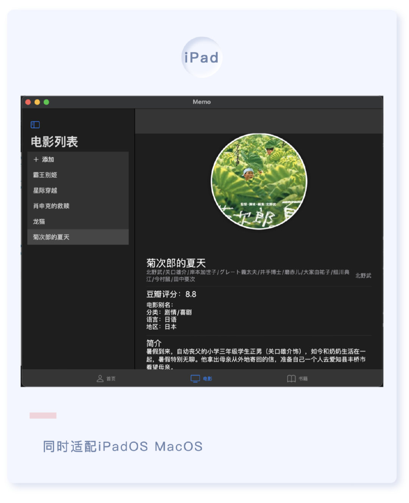
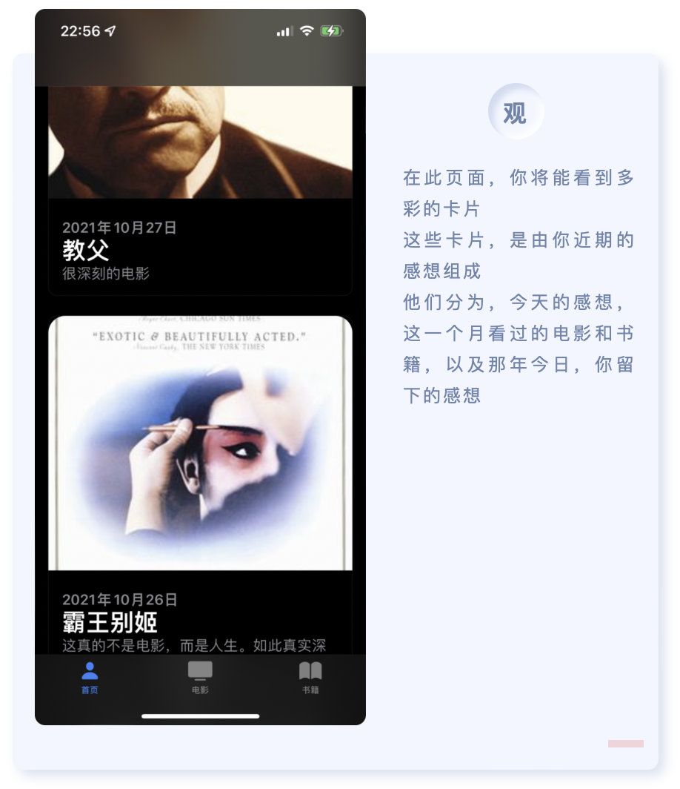
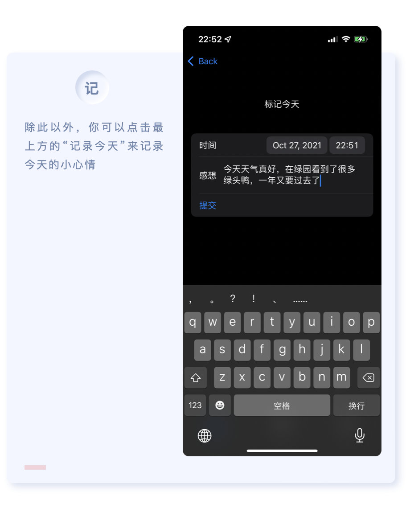
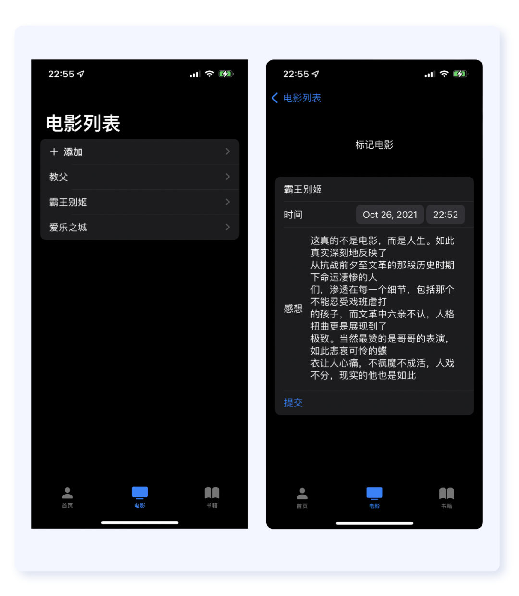
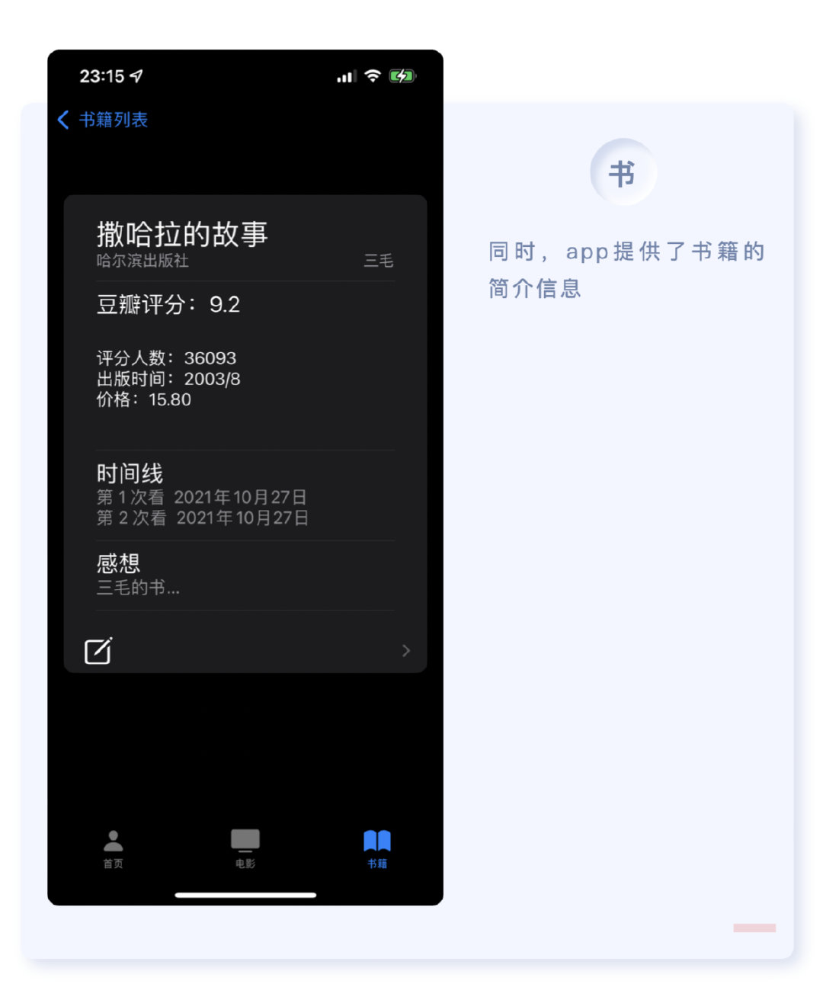
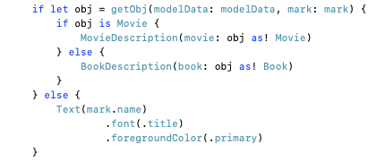
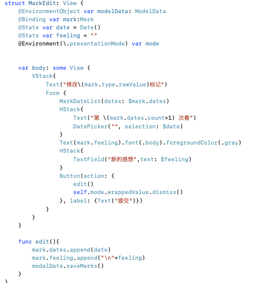
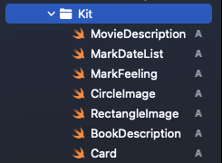

# Memo

Memo用于随时记录，记录生活中的某一刻，记录今天的心情，或是记录看过的一部电影，一本书，留下自己此时的感想，并在自己最爱的电影或书籍的二刷三刷后再次记录下时间和新的想法...

灵感来源于豆瓣，比起豆瓣的功能多出的个人需求为：需要一个简洁没有过量冗余信息的片单和书单记录软件，记录二刷，三刷的时间，以及想要随时记录每一天，并且在几年后回顾那年今日，留一些感动与感慨，让每一天都值得被纪念，故开发此软件。

## 图片


（介绍及短评摘自豆瓣，侵删）



Mac, iPad适配

## 简介

### 主页面

主界面分为3个标签：主页，电影，书籍

##### 主页





##### 电影

这里是你看过的电影片单，你可以随时看到你标记过的所有电影，以及在任何时候添加一个新的电影进入你的片单

进入某条电影，如果你输入的电影在数据库之中（数据来自豆瓣，侵删），你就可以看到关于电影的介绍：演员，导演，豆瓣评分，类别，介绍等，以及最重要的，在最下方，看到你第一次观看的时间以及感想

当然，点击此方框，你可以进入到第二次标记的页面，记录下你的第二次观影以及新的感想




##### 书籍

类似电影，这里是你的书单，你可以添加你看过的书籍，并且记录第n次阅读的体验，相信每一次阅读，都会发现不少新东西



## 功能

- 标记某一天的感受
- 标记某本电影，某本书
- 多次标记某电影和书的观看时间和感受
- 自动展示电影和书籍的相关图片与简介
- 图文并茂的主页卡片展示设计
- 在主页展示进一个月看过的电影
- 在主页展示今天以及那年今日的感想

## 架构以及实现

源代码文件共25个

主要分为三个部分：Controller Model Views


#### Controller

一些静态函数，实现点击界面按钮后的某些后端反应以及后端用到的函数，如图像获取，日期格式化，Mark筛选等

其中图片的读取使用了异步加载url的方式，如果url没有解析成功将不会显示图片

```swift
class ImageLoader: ObservableObject {
    var didChange = PassthroughSubject<Data, Never>()
    var data = Data() {
        didSet {
            didChange.send(data)
        }
    }

    init(urlString: String) {
        guard let url = URL(string: urlString) else {
            return
        }
        let task = URLSession.shared.dataTask(with: url) { (data, response, error) in
            guard let data = data else {
                return
            }
            DispatchQueue.main.async {
                self.data = data
            }
        }
        task.resume()
    }
}

```

#### Model

主要用到的对象为Mark：

```swift
class Mark: Codable, Identifiable{
    var index:Int = 0
    var type:ModelType = ModelType.NONE
    var name = ""
    var dates: [Date] = []
    var feeling = ""

    init(index: Int,type:ModelType, name:String, date:Date, feeling:String){
        self.index = index
        self.type = type
        self.name = name
        self.dates.append(date)
        self.feeling = feeling
    }
}
```

Movie, Book 为电影和书籍的简介，不进行重复的展示

他们遵循MarkableObject协议，用于在展示Mark详情时读取object后再作类型判断

```swift
struct Movie: Hashable, Codable, Identifiable, MarkableObject {
    var id: String = ""
		...
}
```

ModelData负责数据存储的任务

用到了自带的UserDefaults.standard存储数据

movies和books分别为电影和书籍数据集，内置在app中

```swift
final class ModelData: ObservableObject {
    var moviesDict = getMoviesDict(movies: load("movies.json"))
    var booksDict = getBooksDict(books: load("books.json"))
    @Published var marks: [Mark] = []

    init() {
        loadMarks()
    }

    func loadMarks() {
        marks = UserDefaults.standard.object(([Mark]).self, with: "Marks") ?? []
    }

    func saveMarks() {
        let standard = UserDefaults.standard
        standard.set(object: marks, forKey: "Marks")
    }
}
```

ModelType为枚举类型，用于Mark类型判断

```swift
enum ModelType: String, Codable {
    case NONE = "无"
    case MOVIE = "电影"
    case BOOK = "书籍"
    case DAY = "今天"
}
```

#### Views

界面UI

用到了environmentObject来同步各个界面的数据

父界面给子界面传递@Binding的变量，子界面拿到引用直接演示和修改，不会出现数据不同步的问题

```swift
@main
struct MemoApp: App {
    @StateObject private var modelData = ModelData()
    var body: some Scene {
        WindowGroup {
            ContentView()
                    .environmentObject(modelData)
        }
    }
}
```

##### MainMenu

MarkList: Mark列表，即展示电影和书籍列表

使用NavigationLink，向子界面：MarkDetail传递mark的引用


HomeView: 主界面

##### Mark

关于Mark的界面

MarkDetail: 一个Mark的详情

大部分子界面都如此UI一样，引入modelData的环境变量，承接上一级传下来的@Binding变量，实现数据的同步

```swift
@EnvironmentObject var modelData: ModelData
@Binding var mark: Mark
```

其中要进行object的解析，如果用户输入能索引本地数据集的一个条目上，将会展示此object的详情



MarkAdd: Mark增加界面

MarkEdit: Mark修改界面

MarkToday: 标记今天界面

这三个UI都用到了@State来实时同步Form表单中的信息

以至于用户输入能够及时的反应在变量上并且写入modelData



#### Kit

其他组件



电影和书籍详情，时间线，圆形和方形图片，卡片组件等

均已展示在各个页面中

#### 